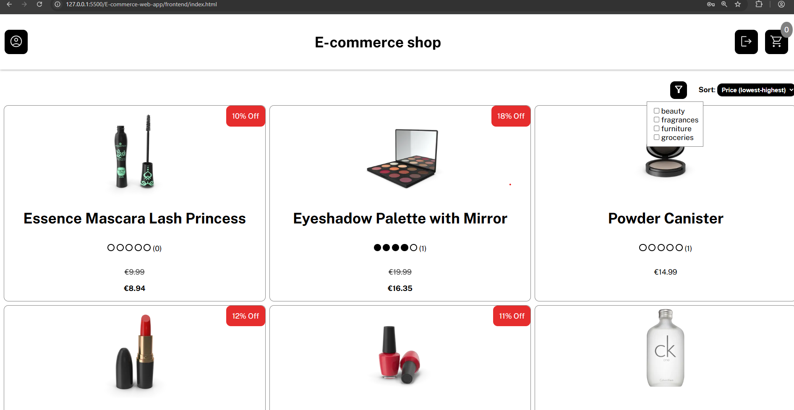
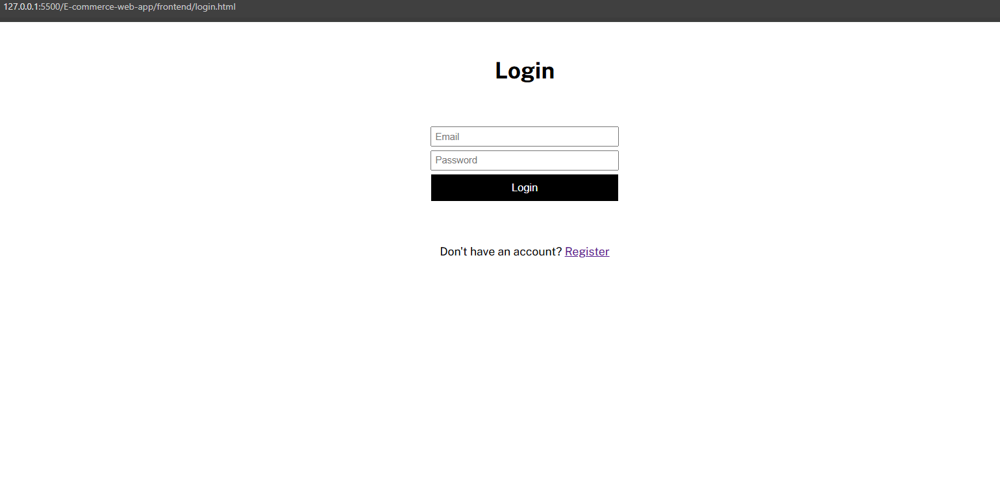
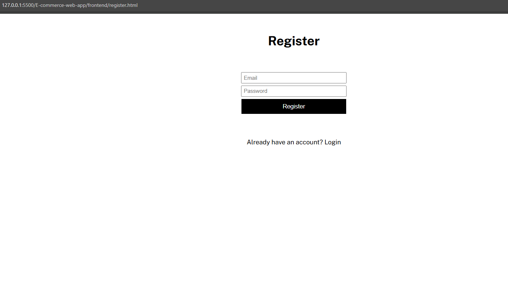
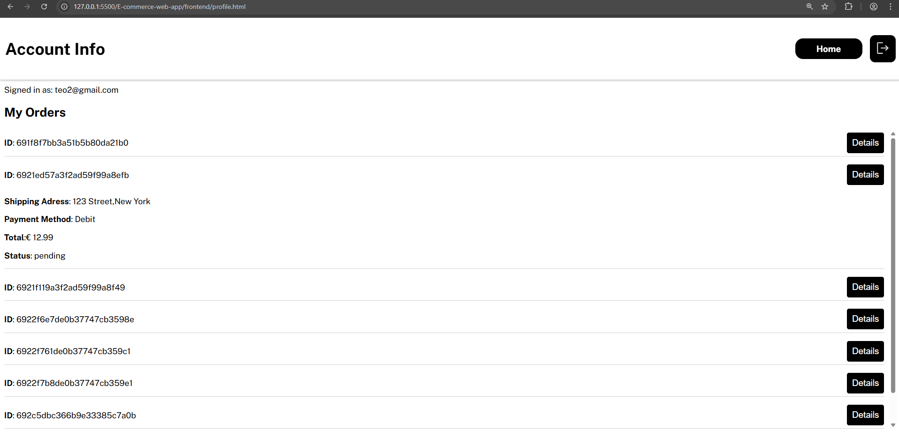
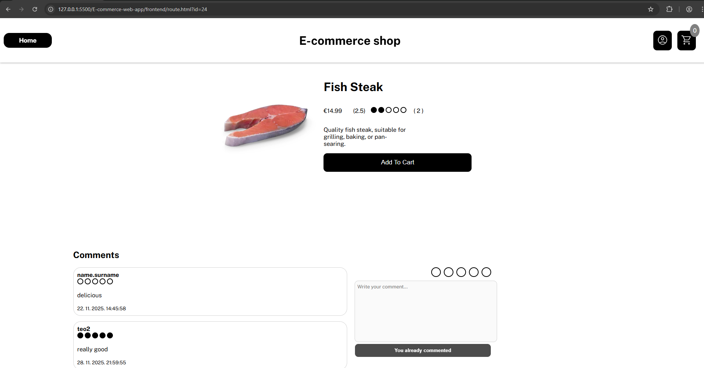
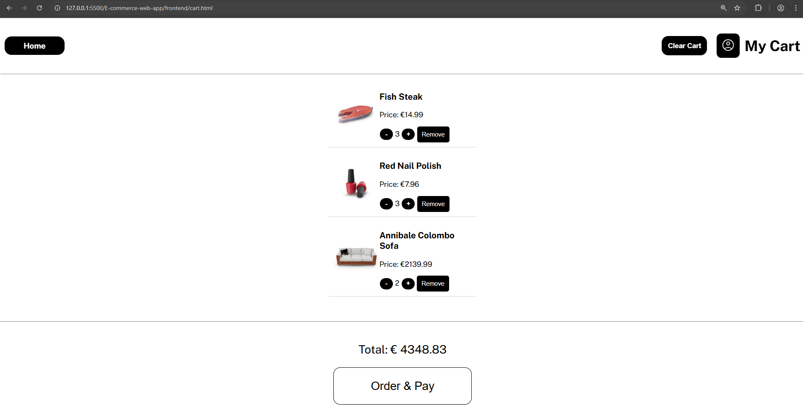
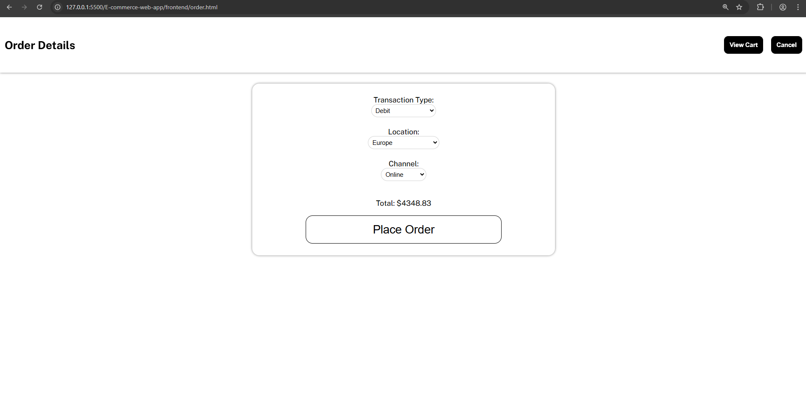
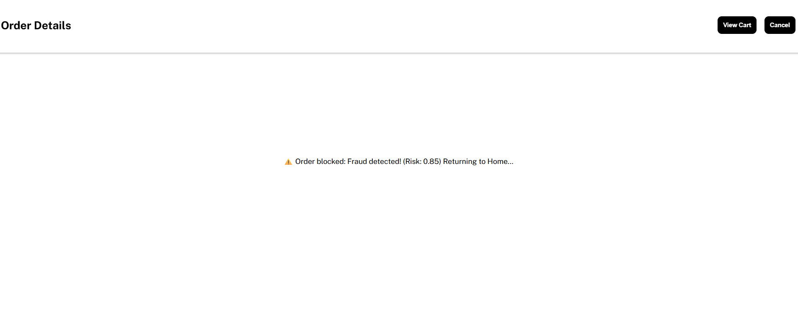

# E-Commerce web shop fullstack project with Fraud Detection

## Features
- User authentication: **Login & Register** using JWT
- Secure password storage and hashing with bycrypt
- Frontend built with **HTML, CSS, JavaScript**
- Backend API using **Node.js / Express** and **Flask** for fraud detection model
- Data storage with **MongoDB**
- Dummy data usage with `dummy.json`
- Responsive UI
- RESTful API structure

## Tech Stack
- **Frontend:** HTML, CSS, JavaScript
- **Backend:** Node.js, Express, Python, Flask
- **Database:** MongoDB
- **Authentication:** JWT
- **Data:** `dummy.json` (for testing/demo)

## System Architecture
The project utilizes a microservices-inspired approach to decouple the core e-commerce logic from the specialized Machine Learning task.
- Client (HTML/JS): Communicates solely with the Node.js API.
- Node.js / Express API: Serves as the main orchestrator, handling authentication, data CRUD (Cart, Profile, Comments, Orders), and routing.
- MongoDB: The central data store for all persistent application data.
- Transaction Flow: When an order hits the /order/create endpoint, the Node.js server acts as a client, forwarding transaction data to the Flask API.
- Python / Flask API: Receives the transaction payload, runs the data through the PyTorch fraud detection model, and returns the riskScore and isFraudulent boolean back to the Node.js server.
- Decision Logic: Based on the Flask response, Node.js either blocks the transaction (HTTP 403) or saves the order to MongoDB.

### Home Page

### Login Page

### Register Page

### Account Page

### Product Page

### Cart Page

### Order Page

## MongoDB storing
## Users collection: -stores registered users 
- _id: ObjectId
- email: String
- password: String(hashed)
- cart: Array 
- createdAt: Date
## Orders collection: -stores orders made by users
- _id: ObjectId
- userId: ObjectId(reference to users)
- items: Array(consists of Object(productId: Number, quantity: Number,price:Number)) 
- totalAmount: Number
- paymentMethod: String
- shippingAddress: String
- status: String
- riskScore: Number exp.(0.005654)
- isFraudulent: Bool
- createdAt: Date

## Commments collection: -stores comments made by users 
- _id: ObjectId
- userId: ObjectId(reference to users)
- productId: String
- content: String 
- createdAt: Date

### Transaction Fraud detection model
- For a clean preview of the model and details here is a link to my jupyter notebook of the model used in project: *https://github.com/Teo-T64/Transaction-Fraud-detection*
- The model was originally trained on a kaggle dataset, using PyTorch, it predicts whether a transaction is fradulent or not based on given features
- The funcionality was implemented to this project using Flask and Python to create an api for detecting simulated fradulent detection.
### Model in action 

- Here based on the data the model has received, it blocked the order because the risk factor is above 0.5 which indicates that the transaction is fradulent.
### Dummy data for testing the model
- This is a simulated scenario of the data the model should receive within the backend of the project *server/routes/orderRoute.js*
## Clean type of data (model predicts <0.5 -> not fradulent)
`const fraudPayload = {
      TransactionAmount: orderData.TransactionAmount,
      TransactionType: orderData.TransactionType,
      Location: orderData.Location,
      Channel: orderData.Channel,
      CustomerAge: 28,
      CustomerOccupation: "engineer",
      TransactionDuration: 60,
      LoginAttempts: 2,
      AccountBalance: 5500,
      TransactionDate: new Date().toISOString(),
      PreviousTransactionDate: new Date(Date.now() - 24*60*60*1000).toISOString(),
      ip_address: "127.0.0.1"
};
`
## Invalid type of data (model predicts >= 0.5 -> fradulent)
`const fraudPayload = {
      TransactionAmount: orderData.TransactionAmount,
      TransactionType: orderData.TransactionType,
      Location: orderData.Location,
      Channel: orderData.Channel,
      CustomerAge: 18,
      CustomerOccupation: "student",
      TransactionDuration: 20,
      LoginAttempts: 20,
      AccountBalance: 500,
      TransactionDate: new Date().toISOString(),
      PreviousTransactionDate: new Date(Date.now() - 24*60*60*1000).toISOString(),
      ip_address: "127.0.0.1"
};
`
### Setting up the project
1. Clone the repo
git clone <https://github.com/Teo-T64/E-commerce-web-app.git>
cd <your-project-directory>
3. Python folder setup
cd fraud_service
python3 -m venv venv - create virtual environment for the project 
source venv/bin/activate  # On Windows, use: venv\Scripts\activate
pip install -r requirements.txt - install needed libraries for the model
4. Create Node backend
cd ../ (if needed)
cd server
npm install
5. Create an .env file containing:
PORT (for Node backend)
MONGO_URI = Your mongoDB cluster link
JWT_SECRET
6. Start Node server
npm run dev
### Endpoints in project
## 🔗 E-Commerce Webshop API Endpoints Reference

This table provides a comprehensive reference for the main API endpoints managed by your Node.js/Express server.

---

### 1. User & Authentication Endpoints (`/auth` and `/profile`)

| Path | Method | Purpose | Protection | Notes |
| :--- | :--- | :--- | :--- | :--- |
| `/auth/register` | `POST` | Create a new user account. | None | Stores hashed password. |
| `/auth/login` | `POST` | Authenticate user. | None | Returns a **JWT Token**. |
| `/profile/me` | `GET` | Retrieve the authenticated user's details. | **User Token** | Returns user data, excluding the password hash. |

---

### 2. Shopping Cart Endpoints (`/cart`)

| Path | Method | Purpose | Protection | Notes |
| :--- | :--- | :--- | :--- | :--- |
| `/cart` | `GET` | Retrieve the authenticated user's cart. | **User Token** | Returns cart items and grand total. |
| `/cart` | `POST` | Add a product to the cart. | **User Token** | If item exists, increments quantity. |
| `/cart` | `PUT` | Update the quantity of a cart item. | **User Token** | Body requires `productId` and new `quantity`. |
| `/cart/:productId` | `DELETE` | Remove a single product from the cart. | **User Token** | Uses URL parameter for the product ID to remove. |
| `/cart` | `DELETE` | Clear the entire cart. | **User Token** | Resets user's cart array to empty. |

---

### 3. Order & Fraud Detection Endpoints (`/order`)

| Path | Method | Purpose | Protection | Notes |
| :--- | :--- | :--- | :--- | :--- |
| `/order/create` | `POST` | **Place a new order.** | **User Token** | **Triggers API call to Flask for Fraud Risk Score.** |
| `/order/my-orders` | `GET` | Retrieve all orders for the current user. | **User Token** | |

---

### 4. Comments & Ratings Endpoints (`/productInfo`)

| Path | Method | Purpose | Protection | Notes |
| :--- | :--- | :--- | :--- | :--- |
| `/productInfo/comments` | `POST` | **Submit a new comment/review.** | **Token Required** | Should use `req.user._id` for security; includes 1-5 rating validation. |

### Future Improvements
- Adding an admin dashboard for managing orders, products and comments.
- Adding product endpoints and replacing current dummy.json product data source.
- Implement advanced payment system (Stripe) instead of the current dummy system.
